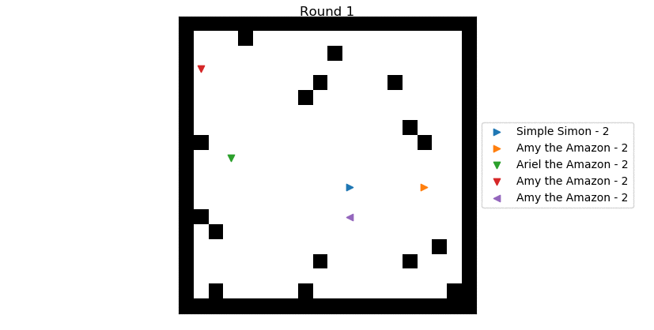

# Speary Bot! :running:← 

Hey now! Things are finally starting to look decent!


## Coding Bots
Bots are written as simple python scripts and should reside in the same folder as server.py. Several example bots are provided for reference. Each bot should always include several things:
  1. Importing the library module
  2. Initialize the bot as the CBot class, giving in a fun name 
  3. For as long as the bot is active:
     * Get the current state of the map from the server
	 * Send a response for what action the bot should take for that round

And that's it! Bot moves are sent as a string, and currently include:

  Command | Description
  --- | ---
  'forward' | Takes one step forward in currently facing direction
  'rotCW' | Rotates 90 degrees clockwise
  'rotCCW' | Rotates 90 degrees counter-clockwise
  'spear' | Throws a spear in the facing direction

(Things are rather simple at the moment!) *Please note that the server enforces a timebomb mechanic where if your bot does not move from a square in 120 turns, it explodes!*

To influence these moves, each bot is given particular information each round from the server. All this information is saved in the bot CBot class and can be accessed via attributes. Information available at the moment includes:

  Attribute | Description
  --- | ---
  .playercount | Returns current number of bots still in the round
  .spearcount | Returns the number of spears you currently have.
  .vision | A list of number values 'seen' by your bot in the direction in is facing. More details below

#### Bot Vision
The .vision attribute will return a list of values depicting everything your bot see's in the direction it is looking. *This list will always begin with your bot itself!* The server keeps track of the map in the following fashion:
  * 0 - Nothing is here
  * 1 - There is a wall here
  * 2 digit number - Bot Identification number, there is a bot here
    * Bots will also have a decimal trailing after them which shows what direction they are facing. .0 is straight up, .1 is to the right, .2 is downwards, and .3 is to the left
  * 2 - A traveling spear. *Dangerous!*
    * Like bots, spears have a trailing decimal indicating their direction of flight
	* Regardless of value, touching them will result in death!
  * 3 - A spear that has struck something and fallen *Not dangerous*

## Running the Server
The server is run from a command prompt or shell following normal python conventions. Bots to compete are added to the prompt following a -i option. For example, to run a competition between the Randomman.py and Simpleman.py, you'd write:
```Shell
python server.py -i Randomman.py Simpleman.py
```
There are several other server flags that may be of use:

  Flag | Default | Use
  --- | --- | ---
  -d *num* | 0 | Will delay the execution of each turn by *num* seconds so the motion can be followed
  -s *num* | 10 | Sets the square size of the arena
  -o *num* | 5 | Sets the maximum number of obstacles scattered about the map
  -v | False | Automatically runs the viewer after the battle is over

## Running the Viewer
The viewer script will by default load the last game replay and _play_ it using a matplotlib interface. It is called automatically if the -v server flag is used, or can be run anytime standalone to rewatch a match. It has a few options:

Flag | Default | Use
--- | --- | ---
-i | lastgame.pickle | If you've saved a game replay under a different name, you can load it with the -i flag
-d | 1 | Speed multiplier of default playback. Matplotlib seems to max out on a multiplier of >5. Fractional values will give slower playback
